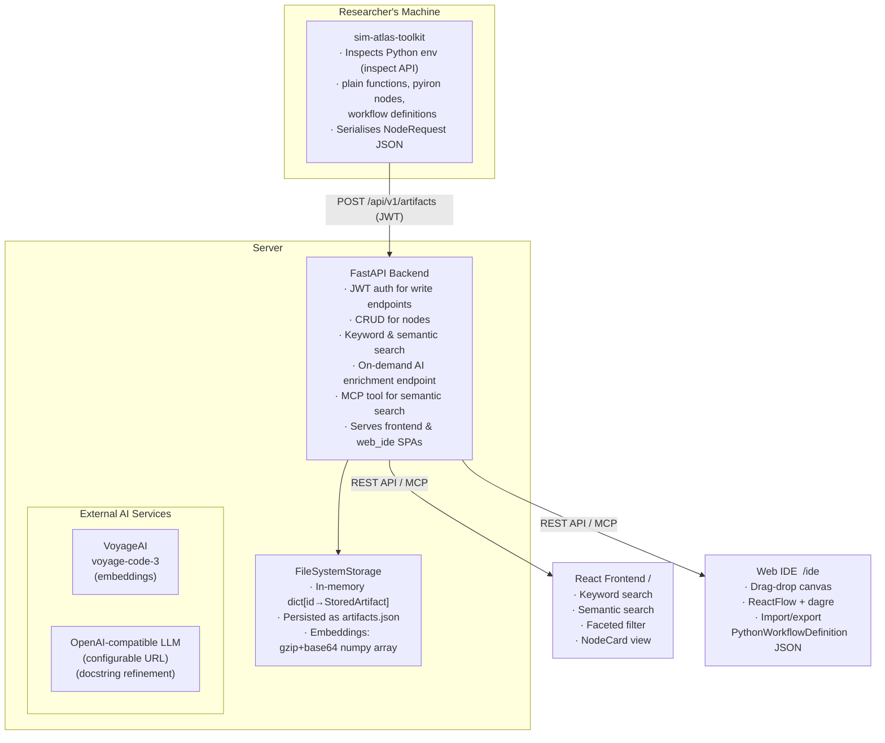
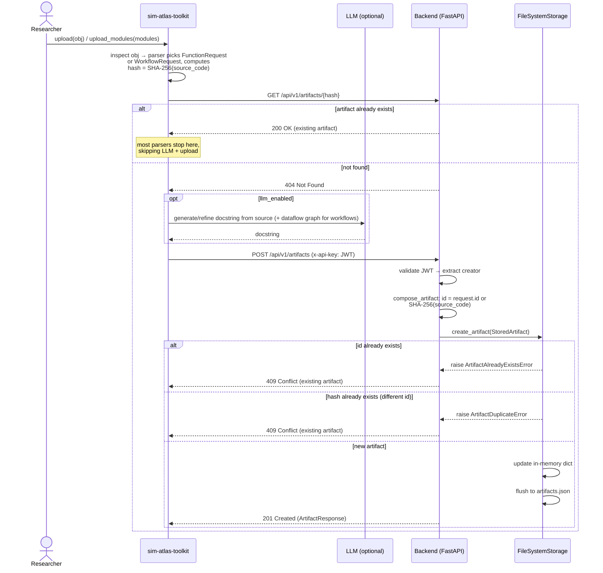
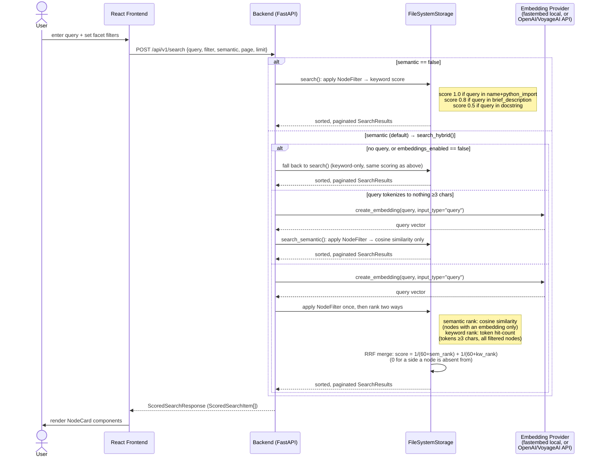

# Software Architecture Document
## Sim Atlas — Simulation Node Search & Discovery Platform

**Version:** 0.2  
**Status:** Active  
**Date:** 2026-04-02

---

## 1. Overview

Sim Atlas is a search and discovery platform for simulation nodes — Python functions, workflow definitions, and pyiron nodes used in scientific computing. Users parse their locally installed Python packages or modules using the **toolkit** client library, then push the extracted metadata to a central server where it becomes searchable by all users via a **React search frontend**.

The system is structured as a **monorepo** containing four sub-packages: `backend`, `frontend`, `web_ide`, and `toolkit`.

---

## 2. Goals & Non-Goals

**Goals**
- Enable fast, faceted search over simulation node metadata (name, docstring, inputs/outputs with physical units and quantities)
- Support semantic search via AI-generated embeddings
- Never execute arbitrary user-provided code on the server
- Keep the server stateless with respect to parsing logic
- Expose a machine-readable MCP tool for AI agent integration
- Provide a visual drag-and-drop workflow composer

**Non-Goals**
- Code execution or sandboxing on the server
- Version control or diff tracking of parsed codebases
- Freshness guarantees — upstream source changes are silently stale (see ADR-0012)
- Multi-tenancy (writes are authenticated but reads are public for v0.1)

---

## 3. Repository Layout

```
sim_atlas/
├── backend/          Python package: sim-atlas-backend (FastAPI server)
├── frontend/         React SPA: keyword & semantic search portal
├── web_ide/          React SPA: visual workflow composer
├── toolkit/          Python package: sim-atlas-toolkit (parser + upload client)
└── docs/             Architecture docs, ADRs
```

The frontend and web_ide build artefacts are served as static files by the backend (see §4.2), producing a single deployable unit.

---

## 4. System Components



---

## 5. Data Flow

### Upload Flow



### Search Flow



---

*End of document.*