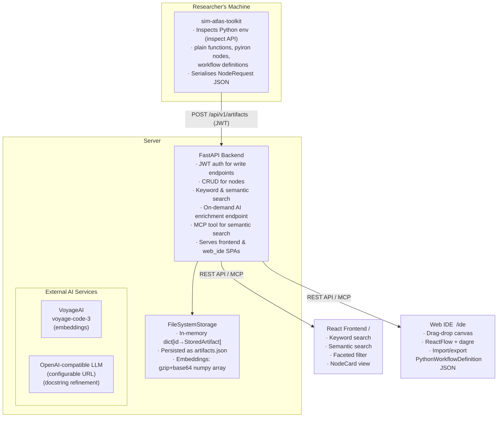
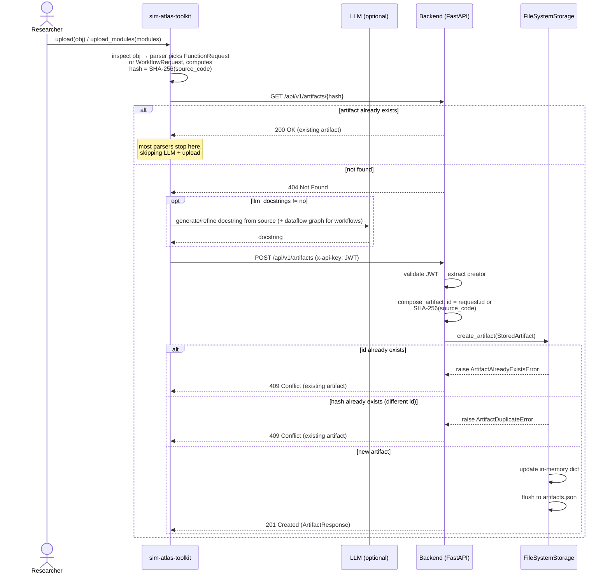
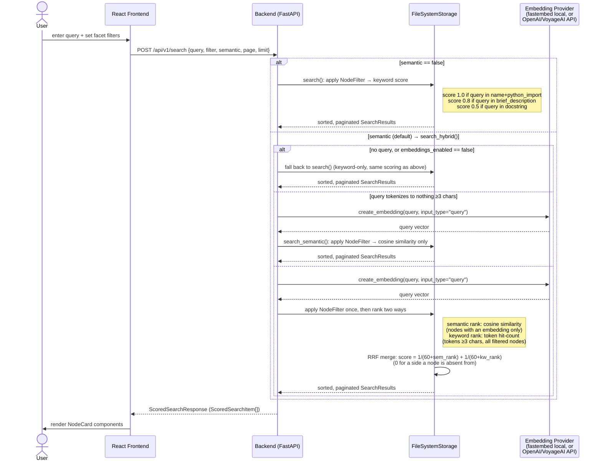

# Software Architecture Document
## Sim Atlas — Simulation Node Search & Discovery Platform

**Version:** 0.2  
**Status:** Active  
**Date:** 2026-04-02

---

## 1. Overview

Sim Atlas is a search and discovery platform for simulation nodes — Python functions, workflow definitions, and pyiron nodes used in scientific computing. Users parse their locally installed Python packages or modules using the **toolkit** client library, then push the extracted metadata to a central server where it becomes searchable by all users via a **React search frontend**.

The system is structured as a **monorepo** containing four sub-packages: `backend`, `frontend`, `web_ide`, and `toolkit`.

---

## 2. Goals & Non-Goals

**Goals**
- Enable fast, faceted search over simulation node metadata (name, docstring, inputs/outputs with physical units and quantities)
- Support semantic search via AI-generated embeddings
- Never execute arbitrary user-provided code on the server
- Keep the server stateless with respect to parsing logic
- Expose a machine-readable MCP tool for AI agent integration
- Provide a visual drag-and-drop workflow composer

**Non-Goals**
- Code execution or sandboxing on the server
- Version control or diff tracking of parsed codebases
- Freshness guarantees — upstream source changes are silently stale (see ADR-0012)
- Multi-tenancy (writes are authenticated but reads are public for v0.1)

---

## 3. Repository Layout

```
sim_atlas/
├── backend/          Python package: sim-atlas-backend (FastAPI server)
├── frontend/         React SPA: keyword & semantic search portal
├── web_ide/          React SPA: visual workflow composer
├── toolkit/          Python package: sim-atlas-toolkit (parser + upload client)
└── docs/             Architecture docs, ADRs
```

The frontend and web_ide build artefacts are served as static files by the backend (see §4.2), producing a single deployable unit.

---

## 4. System Components


```mermaid
flowchart TD
    subgraph RM["Researcher's Machine"]
        T["sim-atlas-toolkit<br/>· Inspects Python env (inspect API)<br/>· plain functions, pyiron nodes,<br/>  workflow definitions<br/>· Serialises NodeRequest JSON"]
    end

    subgraph SRV["Server"]
        B["FastAPI Backend<br/>· JWT auth for write endpoints<br/>· CRUD for nodes<br/>· Keyword & semantic search<br/>· On-demand AI enrichment endpoint<br/>· MCP tool for semantic search<br/>· Serves frontend & web_ide SPAs"]
        FS["FileSystemStorage<br/>· In-memory dict[id→StoredArtifact]<br/>· Persisted as artifacts.json<br/>· Embeddings: gzip+base64 numpy array"]
        subgraph AI["External AI Services"]
            V["VoyageAI<br/>voyage-code-3<br/>(embeddings)"]
            L["OpenAI-compatible LLM<br/>(configurable URL)<br/>(docstring refinement)"]
        end
    end

    F["React Frontend  /<br/>· Keyword search<br/>· Semantic search<br/>· Faceted filter<br/>· NodeCard view"]
    W["Web IDE  /ide<br/>· Drag-drop canvas<br/>· ReactFlow + dagre<br/>· Import/export<br/>  PythonWorkflowDefinition JSON"]

    T -->|"POST /api/v1/artifacts  (JWT)"| B
    B --> FS
    B -->|"REST API / MCP"| F
    B -->|"REST API / MCP"| W
```

---

## 5. Data Flow

### Upload Flow


```mermaid
sequenceDiagram
    actor R as Researcher
    participant T as sim-atlas-toolkit
    participant L as LLM (optional)
    participant B as Backend (FastAPI)
    participant S as FileSystemStorage

    R->>T: upload(obj) / upload_modules(modules)
    T->>T: inspect obj → parser picks FunctionRequest<br/>or WorkflowRequest, computes<br/>hash = SHA-256(source_code)
    T->>B: GET /api/v1/artifacts/{hash}
    alt artifact already exists
        B-->>T: 200 OK (existing artifact)
        Note over T: most parsers stop here,<br/>skipping LLM + upload
    else not found
        B-->>T: 404 Not Found
        opt llm_docstrings != no
            T->>L: generate/refine docstring from source (+ dataflow graph for workflows)
            L-->>T: docstring
        end
        T->>B: POST /api/v1/artifacts (x-api-key: JWT)
        B->>B: validate JWT → extract creator
        B->>B: compose_artifact: id = request.id or<br/>SHA-256(source_code)
        B->>S: create_artifact(StoredArtifact)
        alt id already exists
            S-->>B: raise ArtifactAlreadyExistsError
            B-->>T: 409 Conflict (existing artifact)
        else hash already exists (different id)
            S-->>B: raise ArtifactDuplicateError
            B-->>T: 409 Conflict (existing artifact)
        else new artifact
            S->>S: update in-memory dict
            S->>S: flush to artifacts.json
            B-->>T: 201 Created (ArtifactResponse)
        end
    end
```

### Search Flow


```mermaid
sequenceDiagram
    actor U as User
    participant F as React Frontend
    participant B as Backend (FastAPI)
    participant S as FileSystemStorage
    participant E as Embedding Provider<br/>(fastembed local, or<br/>OpenAI/VoyageAI API)

    U->>F: enter query + set facet filters
    F->>B: POST /api/v1/search {query, filter, semantic, page, limit}
    alt semantic == false
        B->>S: search(): apply NodeFilter → keyword score
        Note right of S: score 1.0 if query in name+python_import<br/>score 0.8 if query in brief_description<br/>score 0.5 if query in docstring
        S-->>B: sorted, paginated SearchResults
    else semantic (default) → search_hybrid()
        alt no query, or embeddings_enabled == false
            B->>S: fall back to search() (keyword-only, same scoring as above)
            S-->>B: sorted, paginated SearchResults
        else query tokenizes to nothing ≥3 chars
            B->>E: create_embedding(query, input_type="query")
            E-->>B: query vector
            B->>S: search_semantic(): apply NodeFilter → cosine similarity only
            S-->>B: sorted, paginated SearchResults
        else
            B->>E: create_embedding(query, input_type="query")
            E-->>B: query vector
            B->>S: apply NodeFilter once, then rank two ways
            Note right of S: semantic rank: cosine similarity<br/>(nodes with an embedding only)<br/>keyword rank: token hit-count<br/>(tokens ≥3 chars, all filtered nodes)
            S->>S: RRF merge: score = 1/(60+sem_rank) + 1/(60+kw_rank)<br/>(0 for a side a node is absent from)
            S-->>B: sorted, paginated SearchResults
        end
    end
    B-->>F: ScoredSearchResponse (ScoredSearchItem[])
    F->>U: render NodeCard components
```

---

## 6. Deployment Behind a Reverse Proxy

Every route except one is a plain request/response and needs no special proxy handling.
`POST /api/v1/agent/stream` is the exception: it is a long-lived Server-Sent Events stream,
and it fails in a distinctive way when proxied naively.

The agent runs *non-streaming* LLM completions, so it emits no bytes at all while a turn is
in flight — and a run may take ten turns (`agent_max_iterations`). Meanwhile the response
headers go out immediately, before the first event is produced. That ordering is what makes
misconfiguration hard to diagnose: once the `200` is on the wire, neither the app nor the
proxy can downgrade a later failure to an error status. The stream is simply reset, which
browsers report as `net::ERR_HTTP2_PROTOCOL_ERROR` over HTTP/2 (or
`ERR_INCOMPLETE_CHUNKED_ENCODING` over HTTP/1.1) with no server-side status to correlate
against.

The backend defends itself on two fronts, so the endpoint works against a default nginx
config:

- `X-Accel-Buffering: no` and `Cache-Control: no-cache` on the response, so nginx streams
  the events instead of buffering them until the response completes.
- A keep-alive frame (`: keep-alive`, an SSE comment) emitted every 15s whenever the agent
  goes quiet — see `with_keepalive` in `backend/src/sim_atlas/agent/_sse.py`. These are real
  bytes, so they reset the read timer at *every* hop, not just the one we know about.

A proxy config is therefore defensive rather than required, but recommended:

```nginx
location /api/v1/agent/stream {
    proxy_pass http://127.0.0.1:8000;

    proxy_http_version 1.1;      # default 1.0 disables chunked upstream + keepalive
    proxy_set_header Connection "";

    proxy_buffering off;         # redundant with X-Accel-Buffering: no, but explicit
    proxy_cache off;
    gzip off;                    # never compress text/event-stream

    proxy_read_timeout 1h;       # the 15s heartbeat already clears the 60s default
    proxy_send_timeout 1h;
}
```

The one line worth applying regardless of the heartbeat is `proxy_http_version 1.1`: nginx
defaults to HTTP/1.0 upstream, which sends `Connection: close` and disables chunked transfer
encoding — enough to break a stream on its own.

To verify a deployment, watch for the heartbeat directly:

```bash
curl -N -X POST https://<host>/api/v1/agent/stream \
  -H 'Content-Type: application/json' \
  -d '{"query":"build me a workflow","nodes":[],"edges":[]}'
```

`: keep-alive` lines should appear roughly every 15s during LLM turns, and the run should
continue past the 60s mark.

---

*End of document.*